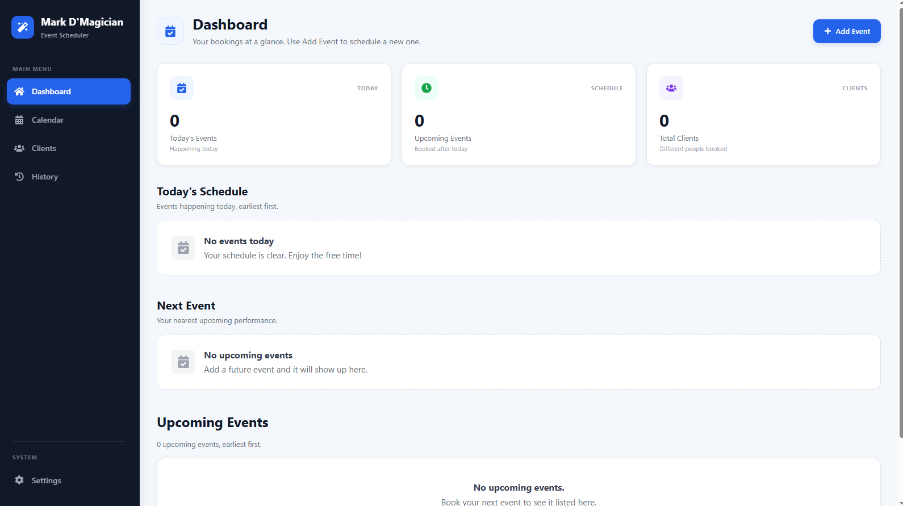
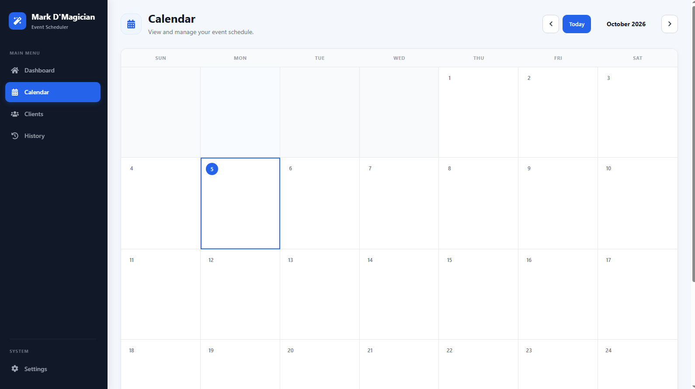
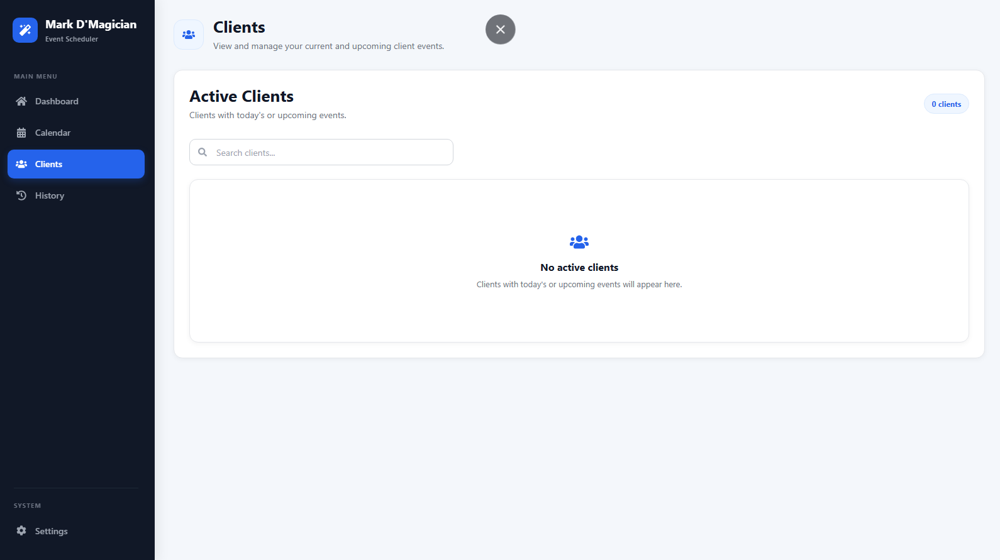
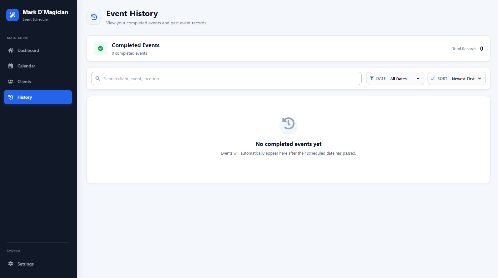
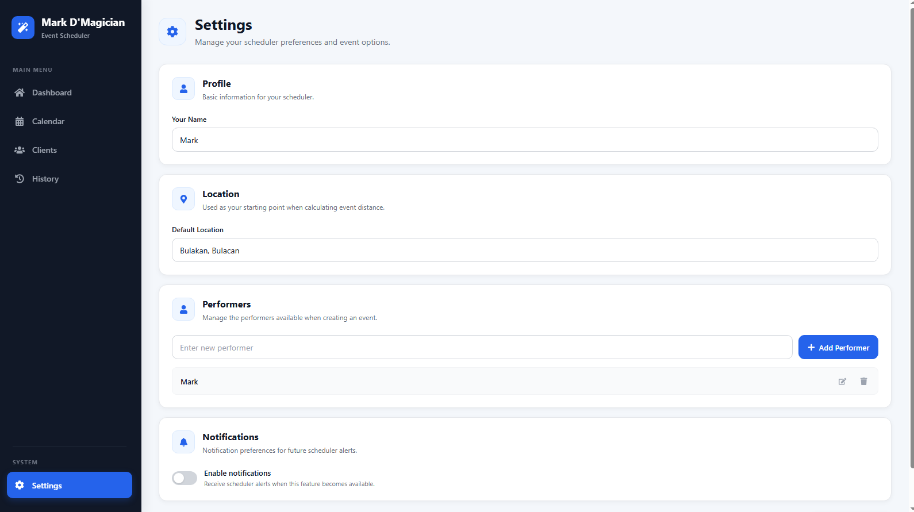

# Magic Scheduler

A full-stack event scheduling and booking management system built for managing event bookings.

Magic Scheduler helps organize upcoming bookings, track event details, manage clients and performers, monitor payments, calculate travel distance, and review completed events through a clean and responsive dashboard.

---

## Overview

Magic Scheduler was developed to make event and performance scheduling easier to manage in one place.

Instead of keeping booking information across different notes or applications, the system provides a centralized platform where event information can be added, edited, viewed, and managed.

The application includes a dashboard, calendar, client management, event history, payment tracking, performer management, and location/distance features.

## Screenshots

### Dashboard



### Calendar



### Clients



### Event History



### Settings



---

## Features

### Dashboard

The dashboard provides a quick overview of scheduled events.

* View today's events
* View the next upcoming event
* View upcoming events
* View total number of clients
* View event date and time
* View event type
* View package
* View performers
* View event location
* View travel distance
* View payment information
* Open the event location using Google Maps
* Edit events
* Delete events
* Add new events
* Display payment status

---

### Event Management

Users can create and manage event bookings.

Each event can contain:

* Client name
* Event type
* Custom event type
* Package
* Custom package
* Event location
* Distance to event location
* Event date
* Event time
* Performers
* Total amount
* Downpayment
* Balance
* Payment status

The application validates important information before saving an event.

Past dates cannot be selected when creating or editing an event.

---

### Event Type

The system provides predefined event types while also allowing custom event types.

Available standard event types include:

* Birthday
* Wedding
* Corporate
* Debut
* Christmas Party
* Others

When **Others** is selected, the user can enter a custom event type.

---

### Package Management

The event form supports predefined packages and a custom package option.

When **Others** is selected, the user can enter a custom package.

---

### Performer Management

Events can have multiple performers.

The application supports:

* Selecting performers
* Adding multiple performers to an event
* Custom performer names
* Managing default performers through Settings

---

### Payment Tracking

Magic Scheduler includes payment tracking for every event.

The system records:

* Total Amount
* Downpayment
* Balance
* Payment Status

The balance is automatically calculated from the total amount and downpayment.

Payment statuses include:

* **Unpaid**
* **Downpayment Paid**
* **Fully Paid**

The system also prevents invalid payment values such as:

* Negative amounts
* Downpayment greater than the total amount

---

### Calendar

The Calendar page provides a monthly view of scheduled events.

Features include:

* Monthly calendar layout
* Previous and next month navigation
* Today button
* Events displayed on their corresponding dates
* Event time display
* Event details
* Location information
* Performer information
* Package information
* Payment information
* Google Maps access
* Event editing
* Event deletion

Past events are displayed as completed records and cannot be edited or deleted from the calendar.

Today's and upcoming events can still be managed.

---

### Client Management

The Clients page organizes events by client.

Features include:

* Client list
* Client search
* Upcoming client events
* Completed client events
* Number of events per client
* Client payment status
* Event details
* Google Maps access
* Event editing
* Event deletion

Selecting a client opens a detailed view of their scheduled and completed events.

---

### Event History

The History page automatically displays completed events.

An event becomes part of the history when its event date has already passed.

Features include:

* Completed event records
* Search
* Date filtering
* Sorting
* Event details
* Payment information
* Performer information
* Location information

Available date filters include:

* All Dates
* This Year
* Previous Years

Available sorting options include:

* Newest First
* Oldest First

Historical records are read-only.

---

### Location and Distance

Magic Scheduler can calculate the distance between the configured starting location and the event location.

The application supports:

* Event location input
* Default starting location
* Browser location as a fallback
* Location geocoding
* Distance calculation
* Google Maps links

The default starting location can be configured from the Settings page.

---

### Settings

The Settings page allows the user to configure scheduler preferences.

Settings include:

* Profile name
* Default location
* Notification preference
* Performer list

The application stores these settings using browser `localStorage`.

Performers can be:

* Added
* Edited
* Deleted
* Updated

Duplicate performer names are prevented.

> Notification settings are currently prepared for future scheduler alerts. Actual notification alerts are not yet implemented.

---

## Technology Stack

### Frontend

* React
* Vite
* JavaScript
* CSS
* React Router
* Axios
* Day.js
* React Icons

### Backend

* Node.js
* Express.js
* MongoDB
* Mongoose
* CORS
* dotenv

### Database

MongoDB is used to permanently store event information.

---

## System Architecture

The application follows a client-server architecture.

```text
                    MAGIC SCHEDULER
                          |
              +-----------+-----------+
              |                       |
          FRONTEND                 BACKEND
              |                       |
        React + Vite            Node.js + Express
              |                       |
          Axios API             REST API Endpoints
              |                       |
              +-----------+-----------+
                          |
                       MongoDB
```

### Data Flow

```text
User
  |
  v
React Interface
  |
  v
Axios
  |
  v
Express API
  |
  v
Mongoose
  |
  v
MongoDB
```

The frontend communicates with the Express backend through HTTP requests.

The backend handles event operations and communicates with MongoDB through Mongoose.

---

## Project Structure

```text
magic-scheduler/
│
├── public/
│
├── src/
│   ├── assets/
│   │
│   ├── components/
│   │   ├── common/
│   │   │   ├── ConfirmModal.jsx
│   │   │   └── PageHeader.jsx
│   │   │
│   │   ├── events/
│   │   │   ├── AddEvent.jsx
│   │   │   └── EditEvent.jsx
│   │   │
│   │   └── layout/
│   │       ├── Layout.jsx
│   │       └── Sidebar.jsx
│   │
│   ├── pages/
│   │   ├── Dashboard.jsx
│   │   ├── Calendar.jsx
│   │   ├── Clients.jsx
│   │   ├── History.jsx
│   │   └── Settings.jsx
│   │
│   ├── utils/
│   │   ├── distance.js
│   │   ├── geocoding.js
│   │   └── location.js
│   │
│   ├── App.jsx
│   └── main.jsx
│
├── server/
│   ├── config/
│   │   └── db.js
│   │
│   ├── controllers/
│   │   └── eventController.js
│   │
│   ├── middleware/
│   │
│   ├── models/
│   │   └── Event.js
│   │
│   ├── routes/
│   │   └── eventRoutes.js
│   │
│   ├── .env
│   └── server.js
│
├── .gitignore
├── package.json
├── vite.config.js
└── README.md
```

---

## Database

The application uses MongoDB to store event records.

Each event contains information such as:

```text
Client
Event Type
Package
Location
Distance
Date
Time
Performers
Total Amount
Downpayment
Balance
Payment Status
```

The database also stores creation and update timestamps.

---

## API

The backend provides REST API endpoints for event management.

### Get All Events

```http
GET /api/events
```

Returns all saved events.

### Create Event

```http
POST /api/events
```

Creates a new event.

### Update Event

```http
PUT /api/events/:id
```

Updates an existing event.

### Delete Event

```http
DELETE /api/events/:id
```

Deletes an existing event.

---

## Installation

### 1. Clone the repository

Clone the project to your computer and open the project folder in VS Code.

---

### 2. Install frontend dependencies

Open a terminal inside the main project folder:

```bash
npm install
```

---

### 3. Install backend dependencies

Move into the server folder:

```bash
cd server
```

Then install the backend dependencies:

```bash
npm install
```

---

### 4. Configure MongoDB

Create the backend environment configuration file:

```text
server/.env
```

Add the MongoDB connection settings required by the database configuration in:

```text
server/config/db.js
```

Keep database credentials private and do not commit them to GitHub.

---

### 5. Start the backend

From the `server` folder:

```bash
node server.js
```

For local development, the backend runs on:

```text
http://localhost:5000
```

The deployed backend API is available at:

```text
https://magic-scheduler-api.onrender.com
```

---

### 6. Start the frontend

Open another terminal and return to the main project folder:

```bash
cd C:\Users\Admin\magic-scheduler\server
```

Then start Vite:

```bash
npm run dev
```

The frontend will be available through the local Vite development server.

---

## Running the Application

You need two terminals while developing the application.

### Terminal 1 — Backend

```bash
cd server
node server.js
```

### Terminal 2 — Frontend

```bash
npm run dev
```

Both the frontend and backend must be running for the application to communicate with the database.

---

## Build for Production

To create a production build of the frontend:

```bash
npm run build
```

The generated production files will be placed in the Vite build output directory.

---

## Event Workflow

The application follows this general workflow:

```text
Add Event
    |
    v
Enter Event Information
    |
    v
Validate Information
    |
    v
Calculate Distance
    |
    v
Calculate Payment Balance
    |
    v
Save Event
    |
    v
MongoDB
    |
    v
Dashboard / Calendar / Clients
    |
    v
Event Completed
    |
    v
History
```

---

## Data Validation

The application includes validation for important event information.

Examples include:

* Required client name
* Required event type
* Required package
* Required location
* Required date
* Required time
* Required performer
* Valid custom values for `Others`
* No past event dates when adding or editing
* No negative payment amounts
* Downpayment cannot exceed total amount

---

## User Interface

The application is designed with a responsive interface for different screen sizes.

The interface includes:

* Sidebar navigation
* Dashboard cards
* Event cards
* Calendar interface
* Modal windows
* Forms
* Confirmation dialogs
* Payment indicators
* Responsive layouts
* Icon-based controls

The project uses React Icons instead of emoji-based interface elements.

---

## Future Improvements

Possible future improvements include:

* Scheduler notifications
* More advanced notification settings
* Authentication and user accounts
* Role-based access
* Online deployment
* More detailed reports
* Revenue analytics
* Exporting events
* Event reminders
* Improved client profiles
* Additional calendar views
* Automated backups

---

## Project Goals

The main goals of Magic Scheduler are to:

1. Keep event bookings organized.
2. Make upcoming performances easy to view.
3. Keep client information connected to their events.
4. Track payments clearly.
5. Make travel planning easier through distance calculation.
6. Provide a calendar-based scheduling experience.
7. Keep completed events available for historical reference.
8. Reduce the need for manual event tracking.

---

## Learning Objectives

This project was also created as a practical full-stack development project.

It demonstrates experience with:

* React component development
* React state management
* React Router
* Form handling
* API requests
* REST API development
* Express.js
* Node.js
* MongoDB
* Mongoose
* CRUD operations
* Data validation
* Local storage
* Geocoding
* Distance calculation
* Responsive web design
* Git and GitHub

---

## Author

**Mark Rainier Lopez**

Computer Engineering Graduate

GitHub: `rainier-code`

---

## License

This project is intended as a personal project and portfolio demonstration.